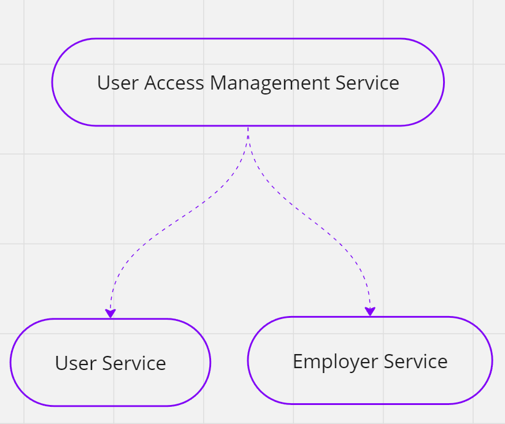

# Origin Backend Take-Home Assignment


You are designing the user access management service of the microservices architecture above.

There are currently two ways that users can have access to the platform:

1. Self-sign up - As a DTC company Origin allows users to self-sign up to the platform using their email and password.
2. Employer eligibility - As a B2B company Origin allows employers to offer access to Origin’s platform via employer benefits, employers must send Origin a file containing all the users enrolled in Origin benefits.

### Functional requirements

User Access Management Service should have **at least** the following REST APIs:

**Signup API:**

```jsx
POST (your path design choice)
{
  "email: "string",
  "password": "string",
	"country": "string/alpha-2/required",
  //Any other fields you need
}
```

The signup API receives the user email and password, its flow should be **at least**:

1. Check if the email is associated with some employer via the eligibility file
    1. If it is, use employer-provided data to create the user
    2. If not, validate if the email already exists
2. Validate password strength
    1. Minimum 8 characters, letters, symbols, and numbers
3. Create the user on User Service

**Eligibility file API:**

```jsx
POST (your path design choice)
{
  "file": "url to some blob storage file"
  "employer_name": "string"
}
```

This API receives the URL to a CSV file to be downloaded and processed, CSV file has the following columns:

| Column | Description | Required |
| --- | --- | --- |
| email | The email of the employee | True |
| full name | The name of the employee | False |
| country | The country of the employee | True |
| birth_date | Birth date of the employee | False |
| salary | The user salary | False |

You should process the file line-by-line, checking for the required columns on each line, at the end you should generate a report file containing all the processed and non-processed lines.

During the file processing, it should:

- Check if the user already exists and update the country and salary
- Terminate the accounts of users attached to that employer that are no longer coming in the eligibility file (this means that the user left his current employer)

**User Service**

You don’t have to implement the User Service, you can just assume you have the following APIs

You can assume you have any other API you need that is not described below.

```jsx
POST /users
{
  "email": "string/required",
  "password": "string/required"
  "country": "string/alpha-2/required",
  "access_type": "string: dtc|employer / required"
  "full_name": "string/optional",
  "employer_id": "string/optional",
  "birth_date": "date/optional",
  "salary": "decimal/optional"
}
```

```jsx
GET /users?email=value
{
  "id": "string",
  "email": "string/required",
  "country": "string/alpha-2/required",
  "access_type": "string: dtc|employer / required",
  "full_name": "string/optional",
  "employer_id": "string/optional",
  "birth_date": "date/optional",
  "salary": "decimal/optional"
}
```

```jsx
GET /users/{id}
{
  "id": "string",
  "email": "string/required",
  "country": "string/alpha-2/required",
  "access_type": "string: dtc|employer / required",
  "full_name": "string/optional",
  "employer_id": "string/optional",
  "birth_date": "date/optional",
  "salary": "decimal/optional"
}
```

```jsx
PATCH /users/{id}
[
  {
    "field": "country",
    "value": "US"
  }
]
```

**Employer Service**

You don’t have to implement the Employer Service, you can just assume you have the following APIs

You can assume you have any other API you need that is not described bellow.

```jsx
GET /employers?name=value
{
  "id": "string"
}
```

### **Non-functional requirements**

- The stack you are more comfortable with.
- You can have any type of persistence you want on User Management Service.
- Eligibility files can be 50+ megabytes long, you must be able to process them on 256 MB RAM environment.
- If you decide to have any other API on User Service or Employer Service, you must document your choice and explain why.


### **Delivery instructions**

- The test deliverable **must** be a publicly or privately forked repository, not a zip file or any other kind of deliverable.
- If it's privately forked, please add `originengineers` user to the collaborators.
