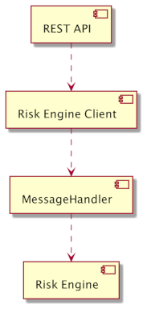
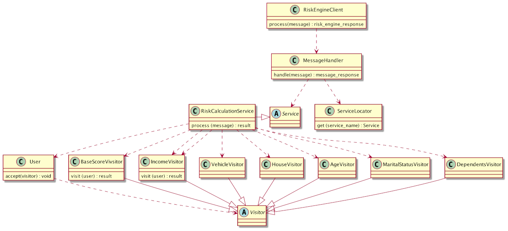
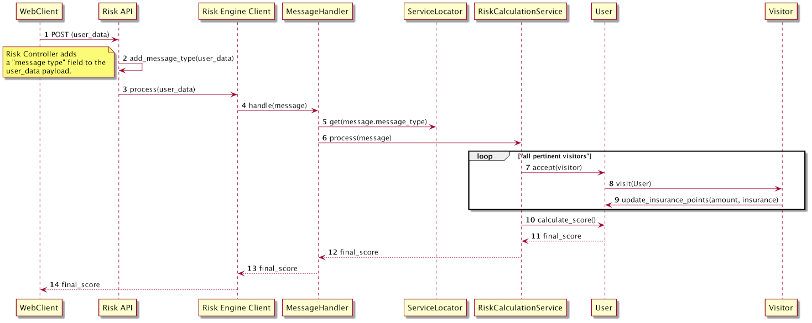

# Risk Calculation Engine

The Risk Calculation Engine calculates risk scores based on user personal data. It consists of a REST API, Risk Calculation Engine
Client, a Message Handler and the Risk Engine Calculation.

## How to run the application

1) Clone the repo https://github.com/OriginFinancial/origin-backend-take-home-assignment.
2) cd into the repo root directory.
3) Type python manage.py runserver
4) Make POST requests to http://127.0.0.1:8000/riskapi/v1/users/risk_score. See the section "The REST API" of this document for 
information about the payload for the POST request.

## How to run tests

### All Tests

Run ```python3 -m unittest discover -v .``` from the root directory of the project.

### Unit Tests
   
Run ```python3 -m unittest discover -v ./test``` from the root directory of the project.

### Integration Tests
   
Run ```python3 -m unittest discover -v ./integration_test``` from the root directory of the project.


### E2E Tests

1) Run the application. (See section ***How to run the application***)

2) Run ```python3 -m unittest discover -v ./e2e_test``` from the root directory of the project.

## Architecture

The application architecture consists of 4 major components. The component diagram bellow depicts those components:



## The REST API

It exposes one endpoint risk_api/v1/users/risk_score which handles only POST calls. The payload that should
be sent via this endpoint and its response are exactly the ones found in the following links:

https://github.com/OriginFinancial/origin-backend-take-home-assignment#the-input

and 

https://github.com/OriginFinancial/origin-backend-take-home-assignment#the-output

### Notes about the REST API:

* The ***REST API*** is at the moment tightly coupled with the ***Risk Calculation Engine Client***. In a real world 
scenario, ideally, this client would be injected into the controller.

* The ***REST API*** also needs to know message types (i.e.: risk_score_calculation). Ideally, the 
client should also hide that implementation detail and expose a method such as:

        RiskEngineClient.ScoreCalculation().process(message)

* Since this is a sample project, there is no security threat that would require HTTPS or avoidance
    of the @csrf_exempt annotation on the exposed endpoint.

## Risk Calculation Engine Client

The goal of the ***Risk Calculation Engine Client*** is to hide, from the REST API layer, the complexity of communicating with the engine. 

For instance, the ***REST API*** layer should not know if the communication with the engine
happens via queues, topics or a message bus. 

This client could also implement a retry strategy for errors, such as, non-deterministic network errors 
that might be hard to troubleshoot.

## Message Handler

The Message Handler routes the messages to the corresponding services of the engine. At the
momement there's only one service (***Risk Calculation Service***). In a real world scenario, the message handler could 
listen to a queue that the ***Risk Engine Calculation Client*** sends messages to. 

## Service Locator

The Service Locator is a known design pattern which serves as an alternative to dependency injection.

The Message Handler uses it to locate the service that should handle the message received.

## Risk Calculation Engine

The ***Risk Calculation Engine*** is responsible for the actual calculation of the risk score.

It now consists of the ***Risk Calculation Service***, one domain entity (***User***) and a set of ***Visitors***.

The Visitor design pattern fits this scenario well, because it allows us to add, modify and remove rules 
of the risk calculation business logic without making modifications to the clients of the ***Risk Calculation Service*** 
(see Class and Sequence diagrams bellow).

Since the final score is calculated based on points given to the different insurance types (auto,
 home, life, disability), each Visitor updates the insurance points of the User entity based on the Visitor's rules. Finally,
our User domain entity calculates the final score based on the insurance points. 

The ***User*** entity can be easily stored in a database for future reference and audit trail.

### Class Diagram



### Sequence Diagram




# Miscellaneous Technical Considerations

## Testing

TDD was used throughout the development of this project. There are three types of tests:

Unit tests under the "test" folder, integration tests under the "integration_test" folder
 and E2E tests under the "e2e_test" folder.
 
The integration tests exercise features by letting components communicate with their dependencies (no mocks, fakes or stubs). 

In a real world scenario, this project would greatly benefit from BDD to test the Risk Engine's
business rules. 

The Given, When, Then approach would be appropriate to test the different scenarios:

```
Given Alice is 45 years old
When she owns a house, a vehicle and no income
Then she is ineligible for disability, auto and home insurance.     
```

## Maintainability

The application of the Single Responsibility principle, cohesive components,  
the proper application of design patterns and automated tests make the project maintainable. 

## Reliability

At the moment the application is a monolith, however, project can be easily 
split into independent deployables for improved reliability and high avaialability:

* The REST API can be deployed to its own server. It could be made scalable and highly available 
when running on EC2s, docker containers or as a AWS API Gateway + Serverless solution, for instance.

* The Risk Calculation Engine could also run in EC2s, Docker containers or Lambdas. 

* Communication between the ***REST API layer*** and the ***Risk Calculation Engine*** could happen via 
a messaging service, such as, ***SQS***.

This would decouple the ***Risk Calculation Engine*** from the ***REST API layer***. Failure in the ***REST API layer*** would not
make the ***Risk Calculation Engine*** unavailable and vice-versa.

##  Error Handling And Logging

An exception hierarchy is of benefit to improve error handling. Ideally, public class methods
should throw exceptions (i.e.: InvalidMessageException). 

No Logging has been added, however, it would be essential in a real world scenario. 

  

  

 


  